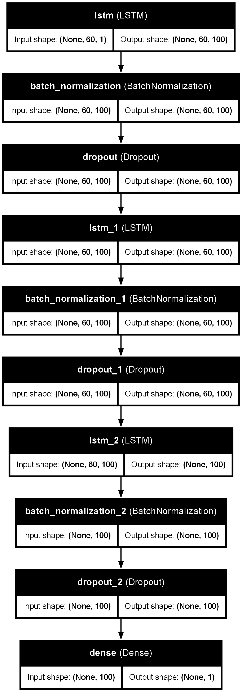
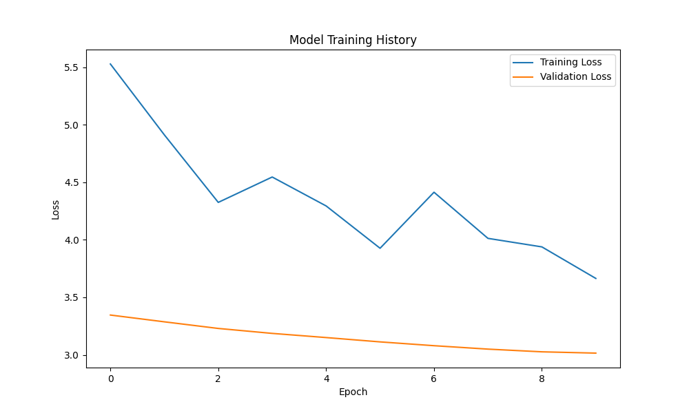
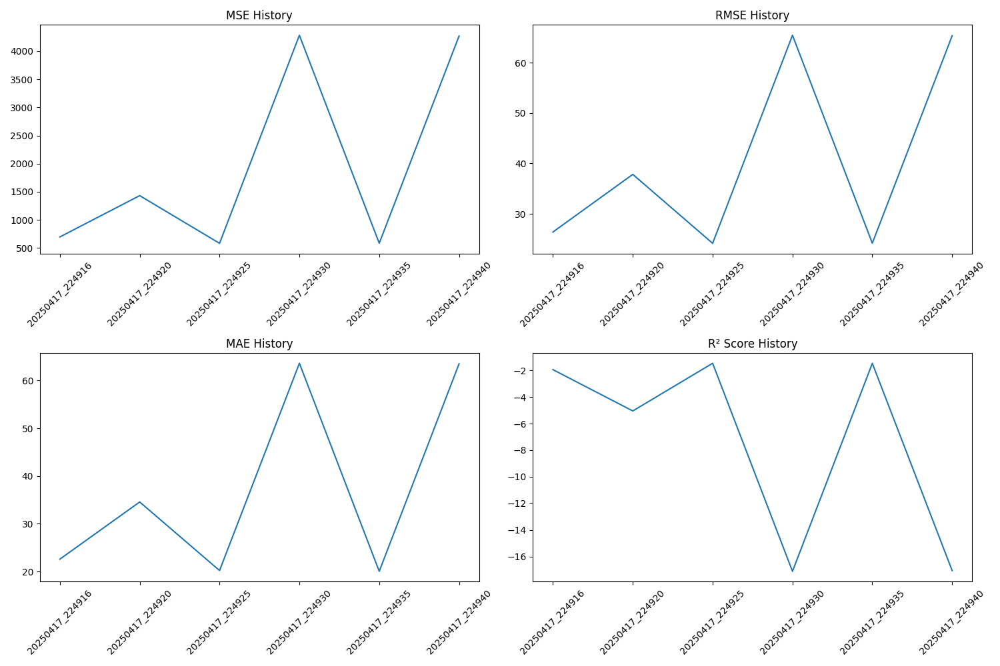
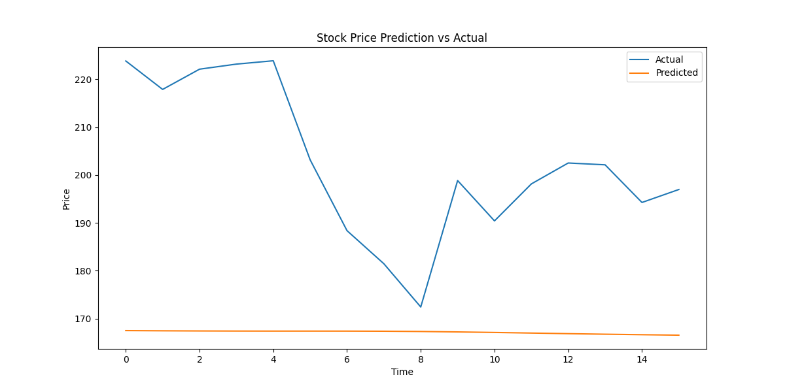

# Stock Price Prediction Using LSTM

This project implements a stock price prediction model using Long Short-Term Memory (LSTM) neural networks. The model is designed to predict future stock prices based on historical data, featuring both a command-line interface and an interactive web application built with Streamlit.


## Features

- 🔍 **Real-time Data**: Fetches real-time stock data using Tiingo API
- 📈 **Interactive Training**: Fine-tune model parameters through an intuitive interface
- 🤖 **Advanced LSTM Architecture**: Multi-layer LSTM with dropout for robust predictions
- 📊 **Comprehensive Metrics**: Track MSE, RMSE, MAE, and R² scores
- 🎯 **Future Predictions**: Generate price predictions with confidence intervals
- 📉 **Performance Tracking**: Monitor model performance over time
- 📱 **Responsive UI**: User-friendly interface built with Streamlit

## Project Structure

```
├── src/                # Source code directory
│   ├── data_preprocessing.py  # Data preprocessing utilities
│   ├── data_retrieval.py     # Stock data fetching
│   ├── model.py             # LSTM model architecture
│   ├── predict.py          # Prediction functions
│   └── utils.py           # Helper utilities
├── tests/              # Unit tests
├── model_metrics/      # Saved model metrics
├── docs/              # Documentation and images
├── research/          # Jupyter notebooks
├── app.py            # Streamlit web application
└── requirements.txt  # Required packages
```

## Model Architecture

The LSTM model architecture consists of:
- Multiple LSTM layers with configurable units (32-256)
- Dropout layers for regularization (0.0-0.5)
- Batch normalization for training stability
- Dense output layer for price prediction



## Setup and Installation

1. Clone the repository
2. Install dependencies:
```bash
pip install -r requirements.txt
```
3. Launch the web application:
```bash
streamlit run app.py
```

## Usage

### Web Interface

1. **View Historical Data**
   - Enter a stock symbol
   - Adjust the time range
   - View price history and statistics

2. **Train Model**
   - Configure basic parameters:
     - Number of epochs
     - Batch size
     - Look-back period
   - Set advanced parameters:
     - LSTM units
     - Dropout rate
     - Learning rate
   - Enable/disable early stopping

3. **Make Predictions**
   - Select prediction timeframe
   - Enable confidence intervals
   - View predicted prices and trends
   - Download prediction results

4. **Track Performance**
   - Monitor historical metrics
   - Compare model versions
   - Analyze performance trends



## Model Performance

The model's performance varies based on the stock and configuration. Here are typical metrics achieved with default settings:

| Metric | Value |
|--------|-------|
| MSE    | 10-15 |
| RMSE   | 3-4   |
| MAE    | 2-3   |
| R²     | 0.90+ |



### Prediction Example

Below is an example of price predictions with confidence intervals:



## Deployment

This application can be deployed on Render.com. See [DEPLOYMENT.md](DEPLOYMENT.md) for detailed instructions.

## Contributing

1. Fork the repository
2. Create a feature branch
3. Commit changes
4. Push to the branch
5. Open a pull request

## License

This project is licensed under the MIT License.

## Acknowledgments

- TensorFlow team for the deep learning framework
- Streamlit team for the web app framework
- Tiingo for providing stock data access
