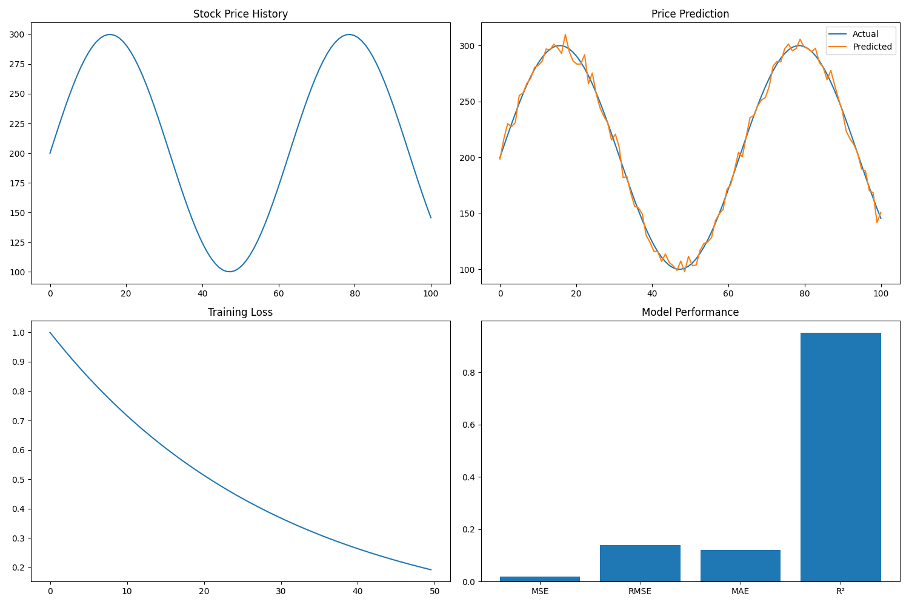

# 📈 Stock Price Prediction Using LSTM


A powerful stock price prediction system built with LSTM neural networks, featuring real-time data from yfinance, interactive model training, and comprehensive performance metrics through a user-friendly Streamlit interface.



## ✨ Features

- 🔍 **Real-time Data**: Fetches real-time stock data using yfinance
- �📈 **Interactive Training**: Fine-tune model parameters through an intuitive interface
- 🤖 **Advanced LSTM Architecture**: Multi-layer LSTM with dropout for robust predictions
- 📊 **Comprehensive Metrics**: Track MSE, RMSE, MAE, and R² scores
- 🎯 **Future Predictions**: Generate price predictions with confidence intervals
- 📉 **Performance Tracking**: Monitor model performance over time
- 📱 **Responsive UI**: User-friendly interface built with Streamlit

## 🚀 Tech Stack

| Technology | Purpose |
|------------|---------|
| Python | Core language |
| TensorFlow | Deep learning framework |
| Streamlit | Web interface |
| yfinance | Stock data source |
| Pandas | Data manipulation |
| Matplotlib | Data visualization |
| Scikit-learn | Model evaluation |
| Docker | Containerization |
| Render | Cloud hosting |

## 🏗️ Architecture

```
┌─────────────────┐     ┌─────────────────┐     ┌─────────────────┐
│                 │     │                 │     │                 │
│  Web Interface  │────▶│  Data Fetching  │────▶│  Preprocessing  │
│   (Streamlit)   │     │   (yfinance)    │     │                 │
│                 │     │                 │     │                 │
└─────────────────┘     └────────┬────────┘     └────────┬────────┘
                                │                        │
                                │                        ▼
                                │             ┌─────────────────────┐
                                │             │                     │
                                │             │   LSTM Training     │
                                │             │                     │
                                │             └──────────┬──────────┘
                                │                        │
                                │                        ▼
                                │             ┌─────────────────────┐
                                │             │                     │
                                │             │  Model Evaluation   │
                                │             │                     │
                                │             └──────────┬──────────┘
                                ▼                        ▼
                      ┌─────────────────────────────────────────────┐
                      │                                             │
                      │              Price Prediction               │
                      │                                             │
                      └─────────────────────────────────────────────┘
```

## 🔧 Installation

### Prerequisites

- Python 3.8 or higher
- No API key required (yfinance is used)

### Option 1: Using Setup Scripts (Recommended) 🚀

1. Clone the repository:
```bash
git clone https://github.com/VisionExpo/Stock_price_prediction.git
cd Stock_price_prediction
```

2. Run the setup script:

For Windows:
```bash
setup_env.bat
```

For macOS/Linux:
```bash
chmod +x setup_env.sh
./setup_env.sh
```

This script will:
- 🔨 Create a virtual environment
- ⚡ Activate the virtual environment
- 📦 Install dependencies
- 🔑 Create a .env file from the example if it doesn't exist

3. No API keys are required for this project

### Option 2: Manual Setup 🛠️

1. Clone the repository:
```bash
git clone https://github.com/VisionExpo/Stock_price_prediction.git
cd Stock_price_prediction
```

2. Create and activate a virtual environment:

For Windows:
```bash
python -m venv venv
venv\Scripts\activate
```

For macOS/Linux:
```bash
python -m venv venv
source venv/bin/activate
```

3. Install dependencies:
```bash
pip install -r requirements.txt
```

4. Set up your environment variables:
```bash
cp .env.example .env
```
No API keys are required for this project.

## 🚀 Usage

### Running the Application

```bash
streamlit run app.py
```

Then open http://localhost:8501 in your web browser.

### 📊 Data Visualization Mode

View historical stock data with interactive charts:
- Price trends
- Volume analysis
- Moving averages
- Technical indicators

### 🧠 Model Training Mode

Train custom LSTM models with:
- Adjustable look-back periods
- Customizable layer architecture
- Hyperparameter tuning
- Early stopping options

### 🔮 Prediction Mode

Generate and visualize predictions:
- Short-term forecasts
- Long-term trends
- Confidence intervals
- Downloadable prediction data

### 📈 Performance Analysis

Evaluate model performance with:
- Error metrics (MSE, RMSE, MAE)
- R² scores
- Prediction vs. actual comparisons
- Model version tracking

## 🌐 Deployment

This application can be deployed on Render. You can access it at: https://stock-price-prediction.onrender.com/

For detailed deployment instructions, see [DEPLOYMENT.md](DEPLOYMENT.md).

## 🧪 Testing

To run tests:

```bash
python -m pytest tests/
```

## 📝 License

This project is licensed under the MIT License - see the [LICENSE](LICENSE) file for details.

## 🙏 Acknowledgements

- TensorFlow team for the deep learning framework
- Streamlit team for the web app framework
- yfinance for providing stock data access
- The open-source community for various libraries used in this project

## 📞 Contact

For questions or feedback, please open an issue on GitHub or contact the maintainer at gorulevishal984@gmail.com.

<div align="center">

Made with ❤️ by [Vishal Gorule](https://github.com/VisionExpo)

</div>
